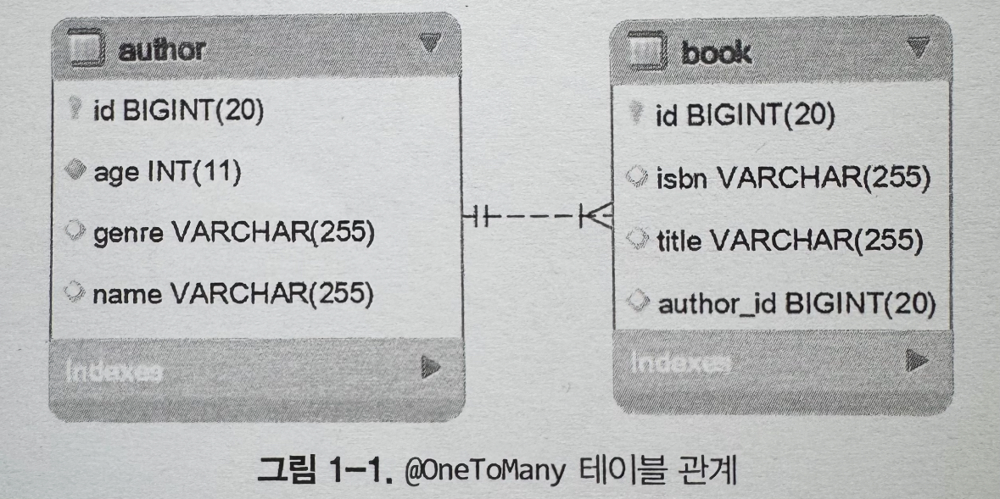
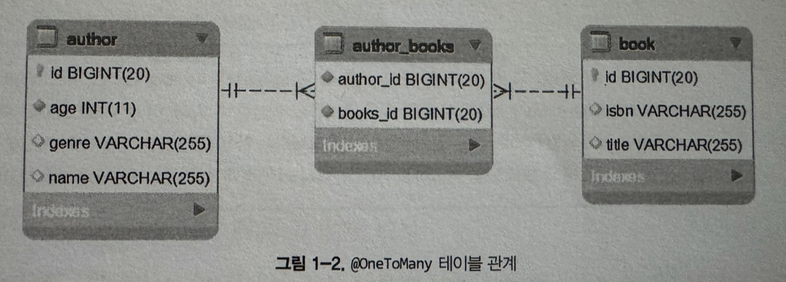
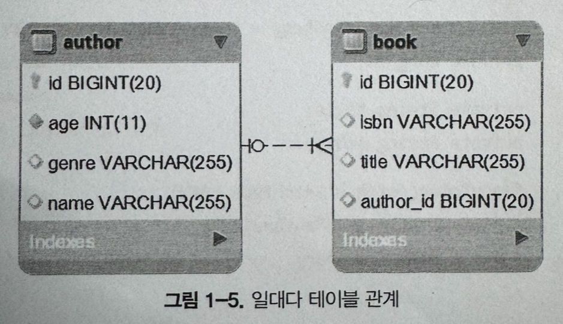
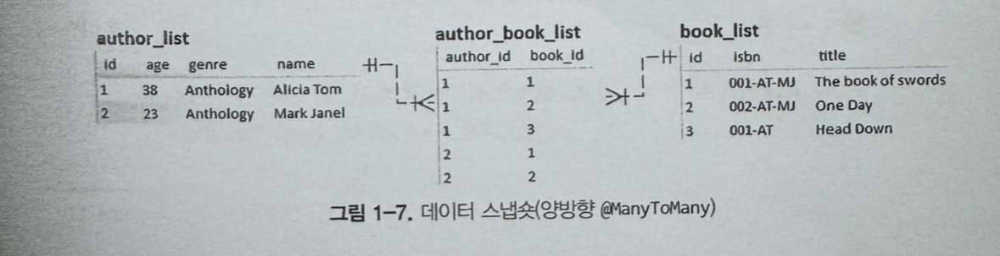
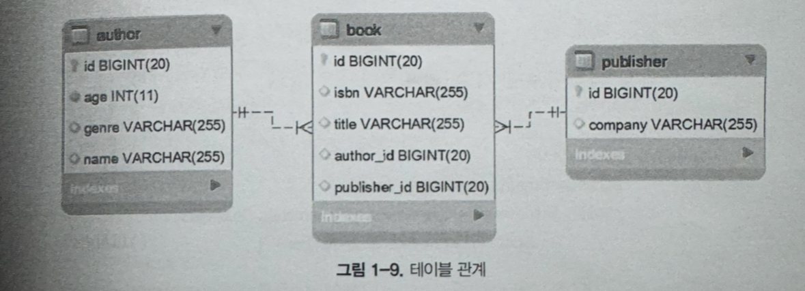
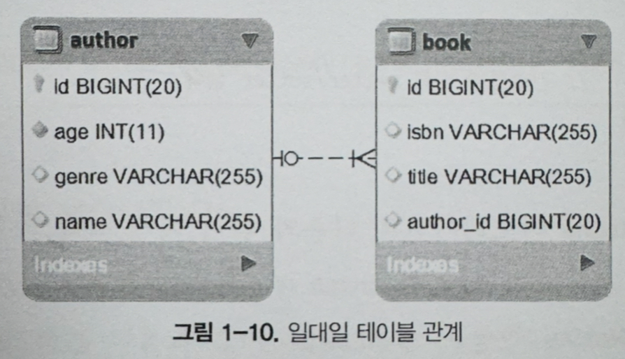

# 1장 연관관계


## 항목 1: @OneToMany 연관관계를 효과적으로 구성하는 방법


### 1) 양방향 @oneToMany 사용</br>


author없는 book은 없기에 </br>
author - @OneToMany (부모측) </br>
book - @ManyToOne (자식측) </br>

- 기본적으로 @OneToMany는 LazyLoading이기 때문에 부모만 1차 캐시에 저장하고 자식은 1차 캐시에 저장하지 않게 되는데 book의 @ManyToOne 이 영속성 컨텍스트의 1차 캐시안에 book의 foreign key를 저장하게 함. 

### 2) 항상 부모측에서 자식 측으로 전이(cascading)를 사용
`@OneToMany(cascade = CascadeType.ALL)` <br>
자식으로부터 부모가 탄생될 수 없는 것처럼 전이는 부모측에서 자식측으로 전이되어야 한다
<br><br>
CascadeType.PERSIST(부모가 영속화 되면 자식도 영속화)
<br>
CascadeType.REMOVE(부모가 삭제되면 자식도 삭제)
<br>
CascadeType.ALL(둘다)


#### 질문? CascadeType.ALL을 사용하고 @ManyToOne을 하지 않으면? <br>
부모가 영속화 될때 자식도 영속화 되긴함. 그러나 자식 엔티티에서 부모 엔티티 참조가 안됨. ManyToOne은 foreign key만 영속화 하고, CascadeType.ALL은 자식 전체를 영속화함

### 3) 부모 측에 mappedBy 지정
`@OneToMany(cascade = CascadeType.ALL, mappedBy = "author")`
<br>
양방향 연관관계를 설정했을때, 관계의 주체가 author임을 명시하는 것. 
그로 인해, 외래키를 자식 엔티티에서 관리하게 하고 명확한 관계 설정을 하게 함<br>
- mappedBy를 사용하지 않을 경우?<br> 
1) 관계의 주체가 자식도 되고 부모도 되기 때문에 관계의 관리가 복잡해질 수 있음.<br>
2) 불필요한 중간 테이블을 생성하게 될 수 있음.

### 4) 부모측에 orphanRemoval 지정
`@OneToMany(cascade = CascadeType.ALL, mappedBy = 'author', orphanRemoval = true)` <br>
더이상 참조되지 않는 자식들의 삭제를 보장함.


### 5) 연관관계의 양측을 동기화 상태로 유지
```java
//Author.java
public void addBook(Book book) {
    this.books.add(book);
    book.setAuthor(this);
}

public void removeBook(Book book) {
    book.setAuthor(null);
    this.books.remove(book);
}

public void removeBooks() {
    Iterator<Book> iterator = this.books.iterator();

    while (iterator.hasNext()) {
        Book book = iterator.next();

        book.setAuthor(null);
        iterator.remove();
    }
}
```

자녀를 하나 추가하면 `this.books.add(book)` <br>
해당 자녀한테도 부모를 설정 `book.setAuthor(this)` 해줘야 하는데<br>
해당 기능이 부모와 자녀로 각각 나뉘어져 있으면 자녀 설정은 해주고 부모 설정은 안해주는 실수가 발생할 수 있어서 부모측에 위와같이 helper 메소드를 만들어서 관리해준다.

### 6) equals()와 hashCode() 오버라이딩
- equals : 객체의 동등성을 비교하는 메소드
- hashCode : 객체를 식별하는 고유한 해시코드를 반환. 해시 기반 컬렉션(예: HashSet, HashMap)에서 객체를 빠르게 검색하거나 삽입할 때 사용됨

```java
//Book.java
@Override
public boolean equals(Object obj) {
    if (obj == null) {
        return false;
    }
    if (this == obj) {
        return true;
    }
    if (getClass() != obj.getClass()) {
        return false;
    }

    return id != null && id.equals(((Book) obj).id);
}

@Override
public int hashCode() {
    return Objects.hash(id);
}
```
- @OneToMany 연관관계에서 위의 2개 메소드는 자식측에 재정의
- equals()는 동등한지 검사전에 null 체크가 선행되어야 함
- hashCode()는 상수 값 반환이 필요

### 7) 연관관계 양측에서 지연 로딩 사용
- @OneToMany 는 기본적으로 지연 로딩
- @ManyToOne은 부모 엔티티를 즉시 가져온다. 지연으로 설정하고 쿼리 기반 일때만 즉시 가져오도록 설정 필요
- `@ManyToOne(fetch = FetchType.LAZY)`


### 8) toString() 오버라이딩 방법에 주의
- 부모에서는 자식의 속성을 자식에서는 부모의 속성을 사용하지 않도록 주의
- 사용되면 별도로 SQL문이 실행되거나, LazyInitializationException(엔티티가 로드된 이후, Session이나 EntityManager가 닫히면) 이 발생할 수 있음. 
```java 
// Book.java
@Override
public String toString() {
    return "Book{" + "id=" + id + ", title=" + title + ", isbn=" + isbn + '}';
}
```

### 9) @JoinColumn을 사용해 조인 칼럼 지정
```java
// Book.java
@JoinColumn(name = "author_id")
private Author author;
```
- 의도된 이름을 지정하지 않으면 JPA가 외래키 컬럼 명을 자동 생성
- book 테이블의 외래키가 author_id가 아니라 writer_id 처럼 이름이 다를 수도 있고, 의도를 명확하게 표현해서 가독성을 높이고 실수를 줄이기 위해 꼭 지정하는 것이 좋음


## 항목 2: 단반향 @OneToMany 연관관계를 피해야 하는 이유
```java
// Author.java
@OneToMany(cascade = CascadeType.ALL,
        mappedBy = "author", orphanRemoval = true)
private List<Book> books = new ArrayList<>();
```
- @OneToMany를 등록하고 @ManyToOne을 누락하면 아래와 같이 별도의 연결 테이블을 생성함 
  - (JPA가 직접 CREATE 쿼리를 날려서 생성하며, hibernate 설정으로 테이블생성을 막아놓으면 에러가 발생한다)



### 1) 일반적인 단방향 @OneToMany

#### a) 저자와 해당 도서 등록
```java
@Transactional
public void insertAuthorWithBooks() {
    Author jn = new Author();
    jn.setName("Joana Nimar");
    jn.setAge(34);
    jn.setGenre("History");

    Book jn01 = new Book();
    jn01.setIsbn("001-JN");
    jn01.setTitle("A History of Ancient Prague");

    Book jn02 = new Book();
    jn02.setIsbn("002-JN");
    jn02.setTitle("A People's History");

    Book jn03 = new Book();
    jn03.setIsbn("003-JN");
    jn03.setTitle("World History");

    jn.addBook(jn01);
    jn.addBook(jn02);
    jn.addBook(jn03);

    authorRepository.save(jn);
}
```
위 메서드를 통해 생성된 SQL문
```sql
INSERT INTO author (age, genre, name) VALUES (?, ?, ?) -- Binding:[34, History, Joana Nimar]
INSERT INTO book (isbn, title) VALUES (?, ?) -- Binding:[001-JN, A History of Ancient Prague]
INSERT INTO book (isbn, title) VALUES (?, ?) -- Binding:[002-JN, A People's History]
INSERT INTO book (isbn, title) VALUES (?, ?) -- Binding:[003-JN, World History]
-- 양방향 @OneToMany에서는 필요 없는 추가 insert 처리
INSERT INTO author_books (author_id, books_id) VALUES (?, ?) -- Binding:[1,1]
INSERT INTO author_books (author_id, books_id) VALUES (?, ?) -- Binding:[1,2]
INSERT INTO author_books (author_id, books_id) VALUES (?, ?) -- Binding:[1,3]
```

#### b) 기존 저자의 새로운 도서 등록
```java
@Transactional
public void insertNewBook() {
    Author author = authorRepository.fetchByName("Joana Nimar");

    Book book = new Book();
    book.setIsbn("004-JN");
    book.setTitle("History Details");

    author.addBook(book); // use addBook() helper

    authorRepository.save(author);
}
```

```sql
INSERT INTO book (isbn, title) VALUES (?, ?) -- Binding:[004-JN, History Details]
-- 아래 DML 문들은 양방향 @OneToMany에서는 나타나지 않음
DELETE FROM author_books WHERE author_id = ? -- Binding:[1]
INSERT INTO author_books (author_id, books_id) VALUES (?, ?) -- Binding:[1,1]
INSERT INTO author_books (author_id, books_id) VALUES (?, ?) -- Binding:[1,2]
INSERT INTO author_books (author_id, books_id) VALUES (?, ?) -- Binding:[1,3]
INSERT INTO author_books (author_id, books_id) VALUES (?, ?) -- Binding:[1,4]
```

#### c) 마지막 도서 삭제
```java
@Transactional
public void deleteLastBook() {
    Author author = authorRepository.fetchByName("Joana Nimar");
    List<Book> books = author.getBooks();

    author.removeBook(books.get(books.size() - 1));
}
```
```sql
DELETE FROM author_books WHERE author_id = ? -- Binding:[1]
INSERT INTO author_books (author_id, books_id) VALUES (?, ?) -- Binding:[1,1]
INSERT INTO author_books (author_id, books_id) VALUES (?, ?) -- Binding:[1,2]
-- 양방향 @OneToMany에서 유일하게 필요한 DML
DELETE FROM book WHERE id = ? -- Binding:[3]
```

#### d) 첫번째 도서 삭제
```java
@Transactional
public void deleteFirstBook() {
    Author author = authorRepository.fetchByName("Joana Nimar");
    List<Book> books = author.getBooks();

    author.removeBook(books.get(0));
}
```
```sql
DELETE FROM author_books WHERE author_id = ? -- Binding:[1]
INSERT INTO author_books (author_id, books_id) VALUES (?, ?) -- Binding:[1,2]
INSERT INTO author_books (author_id, books_id) VALUES (?, ?) -- Binding:[1,3]
-- 양방향 @OneToMany에서 유일하게 필요한 DML
DELETE FROM book WHERE id = ? -- Binding:[1]
```


### 2) @OrderColumn 사용
해당 어노테이션은 name의 컬럼으로 ORDER BY 절을 사용해 정렬되도록 함.<br>
아래와 같이 books_order라는 별도의 컬럼으로 구체화되도록 하이버네이트에 지시함.(없으면 ALTER TABLE로 컬럼을 생성하게함)
```java
@OneToMany(cascade = CascadeType.ALL, orphanRemoval = true)
@OrderColumn(name = "books_order")
private List<Book> books = new ArrayList<>();
```

#### a) 저자와 도서 등록
`insertAuthorWithBooks()` 호출시 아래와 같이 SQL 생성됨. 해당케이스에선 @OrderColumn을 사용하지 않을떄와 동일하다.
```sql
INSERT INTO author (age, genre, name) VALUES (?, ?, ?) -- Binding:[34, History, Joana Nimar]
INSERT INTO book (isbn, title) VALUES (?, ?) -- Binding:[001-JN, A History of Ancient Prague]
INSERT INTO book (isbn, title) VALUES (?, ?) -- Binding:[002-JN, A People's History]
INSERT INTO book (isbn, title) VALUES (?, ?) -- Binding:[003-JN, World History]
-- 양방향 @OneToMany에서는 필요 없는 추가 insert 처리
INSERT INTO author_books (author_id, books_order, books_id) VALUES (?, ?, ?) -- Binding:[1,0,1]
INSERT INTO author_books (author_id, books_order, books_id) VALUES (?, ?, ?) -- Binding:[1,1,2]
INSERT INTO author_books (author_id, books_order, books_id) VALUES (?, ?, ?) -- Binding:[1,2,3]
```

#### b) 기존 저자의 새로운 도서 등록
`insertNewBook()` 호출시 전부 삭제하고 다시 추가하지는 않음. 그러나 양방향 @OneToMany에 비해 여전히 추가 INSERT가 존재.
```sql
INSERT INTO book (isbn, title) VALUES (?, ?) -- Binding:[004-JN, History Details]
-- 양방향 @OneToMany에서는 필요하지 않음
INSERT INTO author_books (author_id, books_order, books_id) VALUES (?, ?, ?) -- Binding:[1,3,4]
```

#### c) 마지막 도서 삭제
`deleteLastBook()` 마찬가지로 전부 삭제하고 다시 추가하지는 않지만, 여전히 불필요한 DELETE는 존재함
```sql
DELETE FROM author_books WHERE author_id = ? and books_order = ? -- Binding:[1, 2]
-- 양방향 @OneToMany에서 유일하게 필요한 DML
DELETE FROM book WHERE id = ? -- Binding:[3]
```
#### d) 첫번째 도서 삭제
`deleteFirstBook()` 컬렉션의 끝에서 멀어질수록 @OrderColumn을 사용하는 이점이 줄어든다.<br>
컬렉션의 메모리내 순서를 유지하기 위한 UPDATE문이 추가 수행된다.
```sql
DELETE FROM author_books WHERE author_id = ? and books_order = ? -- Binding:[1, 2]
UPDATE author_books SET books_id = ? WHERE author_id = ? and books_order = ? -- Binding:[3, 1, 1]
UPDATE author_books SET books_id = ? WHERE author_id = ? and books_order = ? -- Binding:[2, 1, 0]
-- 양방향 @OneToMany에서 유일하게 필요한 DML
DELETE FROM book WHERE id = ? -- Binding:[1]
```


### 3) @JoinColumn 사용
```java
@OneToMany(cascade = CascadeType.ALL, orphanRemoval = true)
@JoinColumn(name = "author_id")
private List<Book> books = new ArrayList<>();
```
해당 어노테이션을 사용하면 @OneToMany 연관관계가 자식 테이블 외래키를 제어할 수 있도록 하이버네이트에 지시함. -> 연결테이블이 필요하지 않음.
#### a) 저자와 도서 등록
```sql
INSERT INTO author (age, genre, name) VALUES (?, ?, ?) -- Binding:[34, History, Joana Nimar]
INSERT INTO book (isbn, title) VALUES (?, ?) -- Binding:[001-JN, A History of Ancient Prague]
INSERT INTO book (isbn, title) VALUES (?, ?) -- Binding:[002-JN, A People's History]
INSERT INTO book (isbn, title) VALUES (?, ?) -- Binding:[003-JN, World History]
-- 양방향 @OneToMany에서는 필요 없는 추가 DML
UPDATE book SET author_id = ? WHERE id = ? -- Binding:[1, 1]
UPDATE book SET author_id = ? WHERE id = ? -- Binding:[1, 2]
UPDATE book SET author_id = ? WHERE id = ? -- Binding:[1, 3]
```
#### b) 기존 저자의 새로운 도서 등록
```sql
INSERT INTO book (isbn, title) VALUES (?, ?) -- Binding:[004-JN, History Details]
-- 양방향 @OneToMany에서는 필요하지 않음
UPDATE book SET author_id = ? WHERE id = ? -- Binding:[1,4]
```

#### c) 마지막 도서 삭제
[1] JPA 영속성 공급자(하이버네이트)는 author_id를 NULL로 지정해서 저자와 도서의 연관관계를 끊고<br>
[2] orphanRemoval=ture 가 연관이 해제된 도서를 삭제시킴
```sql
UPDATE book SET author_id = NULL WHERE author_id = ? AND id = ? -- Binding:[1, 3]
-- 양방향 @OneToMany에서 유일하게 필요한 DML
DELETE FROM book WHERE id = ? -- Binding:[3]
```

#### d) 첫번째 도서 삭제
```sql
UPDATE book SET author_id = NULL WHERE author_id = ? AND id = ? -- Binding:[1, 1]
-- 양방향 @OneToMany에서 유일하게 필요한 DML
DELETE FROM book WHERE id = ? -- Binding:[1]
```

- @JoinColumn, @OrderColumn을 함께 사용해도 양방향 @OneToMany보다 성능이 떨어진다.
- 결과적으로 단방향 @OneToMany는 양방향 @OneToMany와 단방향 @ManyToOne 보다 무조건 성능이 떨어진다.

## 항목 3: 단방향 @ManyToOne의 효율성

`(그림 1-1과 달리 | -> o 로 변경됨. author필수 아님. 저자 없는 도서가 있을 수 있음)`
```java
@Entity
public class Author implements Serializable {
    private static final long serialVersionUID = 1L;

    @Id
    @GeneratedValue(strategy = GenerationType.IDENTITY)
    private Long id;

    private String name;
    private String genre;
    private int age;
    
    ...
}

@Entity
public class Book implements Serializable {
    private static final long serialVersionUID = 1L;

    @Id
    @GeneratedValue(strategy = GenerationType.IDENTITY)
    private Long id;

    private String title;
    private String isbn;

    @ManyToOne(fetch = FetchType.LAZY)
    @JoinColumn(name = "author_id")
    private Author author;
}

```
### 1) 특정 저자에게 새 도서 추가
```java
@Transactional
public void insertNewBook() {
    Author author = authorRepository.getReferenceById(4L);
    // 프록시 객체 반환
    // Author 엔티티의 다른 속성은 가져오지 않음, ID만 사용 SELECT 문 수행 안함.

    Book book = new Book();
    book.setIsbn("003-JN");
    book.setTitle("History Of Present");
    book.setAuthor(author);

    bookRepository.save(book);

    // book.setIsbn("not available");
}
```
```sql
INSERT INTO book (author_id, isbn, title) VALUES (?, ?, ?) -- Binding:[4, 003-JN, HIstory Of Present]
-- 참고 : `Author author = authorRepository.getReferenceById(4L)` 해당 소스가 있어도 SELECT 문이 수행되지 않는다.
-- FetchType.LAZY 이기 때문에 해당 소스는 DB에 접근하지 않고, (author)엔티티의 ID를 가지고 있는 프록시객체(Author의 참조)를 반환함
```

```sql
-- book.setIsbn("not available"); 주석을 해제할 경우
INSERT INTO book (author_id, isbn, title) VALUES (?, ?, ?)
UPDATE book SET author_id = ?, isbn = ?, title = ? WHERE id = ?
-- 더티체킹 메커니즘에 의해 UPDATE 문 수행
```
- 단방향 @ManyToOne의 경우 단방향 @ManyToOne 관계에서 새로운 도서를 추가할 때, Hibernate는 부모 엔티티(Author)의 식별자(ID)를 자식 엔티티(Book)의 외래 키로 저장함
- Author 엔티티의 전체 데이터를 로딩하지 않고, ID만으로 처리하기 때문에 불필요한 데이터베이스 작업을 피하면서 효율적으로 도서를 추가할 수 있다.

### 2) 저자의 모든 도서 가져오기
```java
// BookRepository
@Repository
public interface BookRepository extends PagingAndSortingRepository<Book, Long> {
    @Transactional(readOnly = true)
    @Query("SELECT b FROM Book b WHERE b.author.id = :id")
    List<Book> fetchBooksOfAuthorById(Long id);
}

//BookService
@Service
public class BookstoreService {
    private final BookRepository bookRepository;
    public void fetchBooksOfAuthorById() {
        List<Book> books = bookRepository.fetchBooksOfAuthorById(4L);
    }
}
```
```sql
SELECT
    book0_.id AS id1_1_,
    book0_.author_id AS author_i4_1_,
    book0_.isbn AS isbn2_1_,
    book0_.title AS title3_1_
FROM book book0_
    WHERE book0_.author_id = ?
```
```java
//BookService
@Transactional
public void fetchBooksOfAuthorById() {
    List<Book> books = bookRepository.fetchBooksOfAuthorById(4L);

    books.get(0).setIsbn("not available");
}
```
```sql
SELECT
    book0_.id AS id1_1_,
    book0_.author_id AS author_i4_1_,
    book0_.isbn AS isbn2_1_,
    book0_.title AS title3_1_
FROM book book0_
    WHERE book0_.author_id = ?

UPDATE book SET author_id = ?, isbn = ?, title = ? WHERE id = ?
```
- 모든 도서를 가져오는 것은 하나의 SELECT 만 필요하므로 위의 작업도 효율적이다. (양방향 @OneToMany는 SELECT 문이 필요하지 않음)
- 그러나 가져온 컬렉션 자체는 하이버네이트에서 관리하지 않아, 변화에 대해서는 더티체킹이 발생하지 않음. (양방향 @OneToMany와의 차이)
- 그러나 가져온 컬렉션의 특정 엔터티의 변화에 대해서는 더티체킹이 발생해서 UPDATE 하게 됨.

### 3) 저자의 도서 페이징 처리
```java
// BookRepository
@Repository
public interface BookRepository extends PagingAndSortingRepository<Book, Long> {
    @Transactional(readOnly = true)
    @Query("SELECT b FROM Book b WHERE b.author.id = :id")
    Page<Book> fetchPageBooksOfAuthorById(Long id, Pageable pageable);
}

//BookService
@Service
public class BookstoreService {
    private final BookRepository bookRepository;
    public void fetchPageBooksOfAuthorById() {
        Page<Book> books = bookRepository.fetchPageBooksOfAuthorById(4L,
            PageRequest.of(0, 2, Sort.by(Sort.Direction.ASC, "title")));

        books.get().forEach(System.out::println);
    }
}
```

```sql
SELECT
    book0_.id AS id1_1_,
    book0_.author_id AS author_i4_1_,
    book0_.isbn AS isbn2_1_,
    book0_.title AS title3_1_
FROM book book0_
    WHERE book0_.author_id = ?
ORDER BY book0_.title ASC LIMIT ?
SELECT
    COUNT(book0_.id) AS col_0_0_
FROM book book0_
    WHERE book0_.author_id = ?
```
- 3)에서와 마찬가지로 컬렉션은 하이버네이트가 관리하지 않지만, 수정에 대해서는 더티 체킹이 발생한다.

### 4) 저자의 모든 도서 가져오기와 새로운 도서 추가
```java
// BookService
@Transactional
public void fetchBooksOfAuthorByIdAndAddNewBook() {
    List<Book> books = bookRepository.fetchBooksOfAuthorById(4L);

    Book book = new Book();
    book.setIsbn("004-JN");
    book.setTitle("History Facts");
    book.setAuthor(books.get(0).getAuthor());

    books.add(bookRepository.save(book));

    System.out.println(books);
}
```
```sql
SELECT
    book0_.id AS id1_1_,
    book0_.author_id AS author_i4_1_,
    book0_.isbn AS isbn2_1_,
    book0_.title AS title3_1_
FROM book book0_
    WHERE book0_.author_id = ?

INSERT INTO book (author_id, isbn, title) VALUES (?, ?, ?)
```
- books.add는 컬렉션이 하이버네이트로 관리되지 않기 때문에 더티체킹이 발생하진 않지만 bookRepository.save 소스 때문에 INSERT 문이 생성됨


### 5) 저자의 모든 도서 가져오기와 도서 삭제
```java
// BookService
@Transactional
public void fetchBooksOfAuthorByIdAndAddNewBook() {
    List<Book> books = bookRepository.fetchBooksOfAuthorById(4L);

    bookRepository.delete(books.remove(0));
}
```
```sql
SELECT
    book0_.id AS id1_1_,
    book0_.author_id AS author_i4_1_,
    book0_.isbn AS isbn2_1_,
    book0_.title AS title3_1_
FROM book book0_
    WHERE book0_.author_id = ?

DELETE FROM book WHERE id = ?
```


#### 양방향 @OneToMany vs 단방향 @ManyToOne
| 특징               | 단방향 `@ManyToOne`                          | 양방향 `@OneToMany`                          |
|-------------------|--------------------------------------------|----------------------------------------------|
| **참조 방향**       | 자식에서 부모만 참조                         | 부모와 자식이 서로 참조                      |
| **외래 키 관리**     | 자식 테이블에 외래 키 저장                    | 자식 테이블에 외래 키, 부모는 자식 컬렉션 관리 |
| **관계의 복잡성**    | 단순한 관계, 성능 효율적                     | 복잡한 관계, 데이터 일관성 관리 필요          |
| **데이터 접근**      | 자식에서 부모 정보만 필요할 때 적합           | 부모와 자식 간의 상호 참조가 필요한 경우 적합 |
| **적용 사례**       | 자식이 부모를 참조하지만 부모는 자식 목록을 관리할 필요가 없을 때 | 부모가 자식을 직접 관리해야 할 때 (예: 목록 추가, 삭제) |


## 항목 4: @ManyToMany 연관관계를 효과적으로 구성하는 방법

- 양쪽 탐색이 가능하므로 둘다 부모가 된다.
- 둘 중 누구도 외래키 보유하지 않고, 중간에 있는 연결 테이블에서 2개의 외래키를 갖게 된다.
- 해당 테이블은 데이터베이스 상에서만 존재하며 실제로 코드상에서는 직접적으로 보이지 않는다.

### 1) 관계의 오너 선택
```java
// Book.java
@ManyToMany(mappedBy = "books")
private Set<Author> authors = new HashSet<>();
```
- 오너와 mappedBy 측을 선택해야 한다.
- 한쪽만 오너가 될 수 있고 변경사항은 오너로부터 DB로 전파됨(중요!)
- 위의 이유로 자주 수정되는 엔터티를 오너로 지정하는 편이 좋다

### 2) 항상 List가 아닌 Set 사용
```java
private Set<Book> books = new HashSet<>();
private Set<Author> authors = new HashSet<>();
```
- 상세 이유는 항목5에 있음

### 3) 연관관계의 양측 동기화 상태 유지
- 좀 더 많이 사용되는 쪽에 도우미 메서드를 추가한다.
- `addBook()`, `removeBook()`, `removeBooks()`를 Author에 추가.
 
### 4) CascadeType.ALL / CascadeType.REMOVE 사용하지 않기
```java
@ManyToMany(cascade = {CascadeType.PERSIST, CascadeType.MERGE})
private Set<Book> books = new HashSet<>();
```
- Author 엔터티를 삭제해도 다른 저자에 의해 Book이 참조될 수 있기 때문에 Book 제거가 호출되지 않아야 한다.
- 마찬가지의 이유로 `orphanRemoval = true` 는 지정되면 안됨.

### 5) Join 테이블 설정
```java
@JoinTable(name = "author_book",
    joinColumns = @JoinColumn(name = "author_id"),
    inverseJoinColumns = @JoinColumn(name = "book_id")
)
private Set<Book> books = new HashSet<>();
```
- 개발자가 혼동하지 않도록 지정해준다
- 오너에만 지정하면 된다

### 6) 연관관계 양측에서 지연 로딩 사용
```java
@ManyToMany(fetch = FetchType.EAGER)
```
- 사용 X
- 이유(by chatGPT)
    1.	N+1 문제 발생: EAGER 로딩으로 인해 많은 추가 쿼리가 발생하여 성능 저하.
    2.	데이터 과다 로딩: 실제로 필요하지 않은 데이터까지 불필요하게 로딩.
	3.	순환 참조 문제: 양쪽 엔티티가 서로를 계속 참조하며 순환 참조로 인해 성능 문제가 발생
	4.	복잡한 데이터베이스 쿼리: JOIN 쿼리가 복잡해지고 성능 저하.
	5.	유연성 저하: EAGER 로딩은 모든 경우에 즉시 로딩을 강제하므로, 필요에 따라 데이터를 로딩하는 유연성이 떨어짐
	6.	대규모 시스템에서의 성능 저하: 대규모 시스템에서는 메모리 및 성능에 큰 부담을 줌.

### 7) equals() / hashCode() 오버라이딩
- 사유는 항목 68에서 자세히..

### 8) toString() 오버라이딩 방법 주의
```java
// Book.java
@Override
public String toString() {
    return "Book{" + "id=" + id + ", title=" + title + ", isbn=" + isbn + '}';
}
```
- 각 엔터티의 기본 속성만 사용하도록 해야 함.

## 항목 5: @ManyToMany에서 Set이 List보다 나은 이유
- @ManyToMany는 2개의 단방향 @OneToMany 연관관계로 처리한다.


### 1) List 사용
- Alicia Tom이 쓴 One Day를 삭제하는 경우 `alicia.removeBook(oneDay)`
```sql
DELETE FROM author_book_list WHERE author_id = ? -- Binding:[1]
INSERT INTO author_book_list (author_id, book_id) VALUES (?, ?) -- Binding:[1,1]
INSERT INTO author_book_list (author_id, book_id) VALUES (?, ?) -- Binding:[1,3]
```
- 모든 연결항목을 삭제후, 삭제 대상이 아닌 것들을 다시 삽입해서 반영

### 2) Set 사용
```sql
DELETE FROM author_book_list WHERE author_id = ? AND book_id = ? -- Binding:[1,2]
```
- List에 비해 훨씬 효율적임

#### a) 결과 세트 순서 유지
- List는 순서를 유지하지만, Set은 그렇지 않음
  - @OrderBy를 사용해 지정된 컬럼으로 정렬하도록 요청
  - @OrderColumn을 사용해 추가 컬럼으로 영구적 순서 유지
#### b) @OrderBy 사용
```java
    @ManyToMany(mappedBy = "books")
    @OrderBy("name DESC")
    // 1) HashSet 사용
    private Set<Author> authors = new HashSet<>(); 
    // 2) LinkedHashSet 사용
    private Set<Author> authors = new LinkedHashSet<>(); 
```
- getAuthors()가 호출되면
  - 호출되는 SQL에 지정된 컬럼의 ORDER BY를 추가함
  - 순서를 유지하고자 하이버네이트에 알림 
  - HashSet을 사용하면 객체가 영속성 컨텍스트를 벗어나서 JVM 힙메모리에만 남아있는 경우에는 순서가 보장되지 않을 수 있다 -> LinkedHashSet 사용

## 항목 6: CascadeType.REMOVE 및 orphanRemoval=true를 사용해 하위 엔터티 제거를 피해야 하는 이유와 시기
- CascadeType.REMOVE vs orphanRemoval=true (양방향 @OneToMany)<br>

| **특징**                    | **CascadeType.REMOVE**                                         | **orphanRemoval=true**                                         |
|-----------------------------|---------------------------------------------------------------|---------------------------------------------------------------|
| **삭제 발생 조건**           | 부모 엔티티가 삭제될 때                                       | 부모 엔티티와 연관 관계가 끊어질 때 (부모는 삭제되지 않음)    |
| **연관 관계 상태**           | 연관 관계가 유지된 상태에서 부모 엔티티가 삭제되는 경우에만 동작 | 연관 관계가 끊어지면 자식 엔티티가 삭제됨                      |
| **주 사용 사례**             | 부모-자식 관계가 강한 경우, 부모가 삭제될 때 자식도 삭제해야 할 때 | 부모-자식 관계에서 자식이 제거되면 삭제해야 할 때              |
| **엔티티 삭제 방식**         | 부모 삭제 시 자식 엔티티에 대한 `REMOVE` 쿼리 전파             | 고아가 된 자식 엔티티가 자동으로 삭제됨                        |
| **적용 가능성**              | 명시적 부모-자식 관계가 유지될 때                             | 연관 관계가 끊어지는 시점에서 적용                             |

```java
// not efficient
@Transactional
public void deleteViaCascadeRemove() {
    Author author = authorRepository.findByName("Joana Nimar");

    authorRepository.delete(author);
}

// not efficient
@Transactional
public void deleteViaOrphanRemoval() {
    Author author = authorRepository.findByNameWithBooks("Joana Nimar");

    author.removeBooks();
    authorRepository.delete(author);
}

//Author.java
public void removeBooks() {
    Iterator<Book> iterator = this.books.iterator();

    while (iterator.hasNext()) {
        Book book = iterator.next();

        book.setAuthor(null);
        iterator.remove();
    }
}
```
```sql
DELETE FROM book WHERE id = ? -- Binding:[1]
DELETE FROM book WHERE id = ? -- Binding:[2]
DELETE FROM book WHERE id = ? -- Binding:[3]
DELETE FROM author WHERE id = ? -- Binding:[1]
```
- 두가지 방법 다 위와같이 DELETE문이 4번 반복돼서 효율적이지 못하다.

### 1) 영속성 컨텍스트에 이미 로드된 저자 삭제

| **속성**                  | **flushAutomatically**                                          | **clearAutomatically**                                       |
|---------------------------|----------------------------------------------------------------|--------------------------------------------------------------|
| **역할**                  | 영속성 컨텍스트의 변경 사항을 자동으로 데이터베이스에 반영    | 메서드 실행 후 영속성 컨텍스트를 자동으로 초기화             |
| **영속성 컨텍스트 상태**   | 변경된 엔티티가 데이터베이스로 플러시됨                        | 모든 엔티티가 영속성 컨텍스트에서 제거됨                     |
| **주 사용 사례**          | 메서드 실행 전에 변경 사항을 데이터베이스에 반영               | 메서드 실행 후 영속성 컨텍스트를 비워서 데이터 동기화        |
| **적용 시기**             | 메서드 실행 중에 플러시가 발생                                 | 메서드가 끝난 후 영속성 컨텍스트가 초기화됨                  |

- 위의 두가지 속성을 활용할 수 있다.

#### a) 하나의 저자만 영속성 컨텍스트에 로드된 경우
```java
// BookRepository
@Transactional
@Modifying(flushAutomatically = true, clearAutomatically = true)
@Query("DELETE FROM Book b WHERE b.author.id = ?1")
int deleteByAuthorIdentifier(Long id);

// AuthorRepository
@Transactional
@Modifying(flushAutomatically = true, clearAutomatically = true)
@Query("DELETE FROM Author a WHERE a.id IN ?1")
int deleteBulkByIdentifier(List<Long> id);

// BookService
@Transactional
public void deleteViaIdentifiers() {
    Author author = authorRepository.findByName("Joana Nimar");

    bookRepository.deleteByAuthorIdentifier(author.getId());
    authorRepository.deleteByIdentifier(author.getId());
    // authorRepository.deleteInBatch(List.of(author));
}
```

```sql
DELETE FROM book WHERE author_id = ?
DELETE FROM author WHERE id = ?
```

- 호출된 DELETE문은 2개뿐이고, 도서수가 DELETE문 수에 영향을 주지 않음.
- 주석처리된 `authorRepository.deleteInBatch(List.of(author))` 를 통해서도 삭제 가능 (동일하게 동작함)

#### b) 여러 저자가 영속성 컨텍스트에 로드된 경우
```java
// BookRepository
@Transactional
@Modifying(flushAutomatically = true, clearAutomatically = true)
@Query("DELETE FROM Book b WHERE b.author.id IN ?1")
int deleteBulkByAuthorIdentifier(List<Long> id);

// BookService
@Transactional
public void deleteViaBulkIn() {
    List<Author> authors = authorRepository.findByAge(34);

    bookRepository.deleteBulkByAuthors(authors);
    authorRepository.deleteInBatch(authors);
}
```

```sql
DELETE FROM book WHERE author_id IN (?, ?)
DELETE FROM author WHERE id = ? OR id = ?
```
- 영관된 도서는 영속성 컨텍스트에 로드되지 않고, 트리거된 DELETE문은 2개뿐

#### c) 한 저자와 관련 도서들이 영속성 컨텍스트에 로드된 경우
```java
@Transactional
public void deleteViaDeleteInBatchX() {
    Author author = authorRepository.findByNameWithBooks("Joana Nimar");

    bookRepository.deleteInBatch(author.getBooks());
    authorRepository.deleteInBatch(List.of(author));

    // 나중에 이 저자가 삭제된 사실을 잊고 아래를 호출하면..?
    author.setGenre("Anthology");
}
```
- deleteInBatch는 영속성 컨텍스트를 flush, clear하지 않는 내장 함수
- 그렇기에 위에서 삭제하고 author.setGenre를 하게 되면 Exception 발생됨.
- deleteInBatch를 override 해서 @Modifying(clearAutomatically = true)를 추가하면 해결되지만 아래와 같이 처리하는것이 더 좋다
```java
@Transactional
public void deleteViaIdentifiers() {
    Author author = authorRepository.findByName("Joana Nimar");

    bookRepository.deleteByAuthorIdentifier(author.getId());
    authorRepository.deleteByIdentifier(author.getId());
}
```

### 2) 삭제해야할 저자와 도서가 영속성 컨텍스트에 로드되지 않은 경우 삭제
```java
@Transactional
public void deleteViaHardCodedIdentifiers() {
    bookRepository.deleteByAuthorIdentifier(4L);
    authorRepository.deleteByIdentifier(4L);
}
```
```sql
DELETE FROM book WHERE author_id = ?
DELETE FROM author WHERE id = ?
```
- 위의 `a) 하나의 저자만 영속성 컨텍스트에 로드된 경우` 와 동일하다.
```java
// AuthorRepository
@Transactional
@Modifying(flushAutomatically = true, clearAutomatically = true)
@Query("DELETE FROM Author a WHERE a.id IN ?1")
int deleteBulkByIdentifier(List<Long> id);

// BookRepository
@Transactional
@Modifying(flushAutomatically = true, clearAutomatically = true)
@Query("DELETE FROM Book b WHERE b.author IN ?1")
int deleteBulkByAuthors(List<Author> authors);

@Transactional
public void deleteViaBulkHardCodedIdentifiers() {
    List<Long> authorsIds = Arrays.asList(1L, 4L);

    bookRepository.deleteBulkByAuthorIdentifier(authorsIds);
    authorRepository.deleteBulkByIdentifier(authorsIds);
}
```
- 벌크로 삭제하는 경우도 위와같이 처리할 수 있으나, 영속성 컨텍스트에 불러오지 않기 때문에 `flushAutomatically = true, clearAutomatically = true` 는 의미가 없다.

## 항목 7: JPA 엔터티 그래프를 통해 연관관계를 가져오는 방법
- JPA createNativeQuery로 JOIN 쿼리를 날리는 것과 동일하긴함.
- 양방향 @OneToMany가 갖는 문제점들
  1. N+1 문제 해결 -> 여러 저자를 한번에 불러올때, 각각 저자의 모든 book들을 전부 SELECT 해야함
  2. 지연 로딩(Lazy Loading)과 즉시 로딩(Eager Loading) 문제 개선 -> 지연로딩 필요할 때 매번 자식을 SELECT 해야함. 즉시 로딩은 불필요한 로딩을 많이 함.
- 전략
  - 페치 그래프 : 기본적으로 그래프에 명시된 필드만 즉시 로딩하고, 나머지는 전부 지연로딩한다. FetchType.EAGER 설정되어 있어도 명시안되면 무조건 지연로딩 FetchType.LAZY로 되어 있어도 명시되면 무조건 즉시 로딩한다.
  - 로드 그래프 : 기본적으로 명시되면 무조건 즉시 로딩. 나머지는 설정된 FetchType에 따른다.

### 1) NamedEntityGraph로 엔터티 그래프 정의
```java
@Entity
@NamedEntityGraph(
    name = "author-books-graph",
    attributeNodes = {
        @NamedAttributeNode("books")
    }
)
public class Author implements Serializable {
    private static final long serialVersionUID = 1L;

    @Id
    @GeneratedValue(strategy = GenerationType.IDENTITY)
    private Long id;

    private String name;
    private String genre;
    private int age;

    @OneToMany(cascade = CascadeType.ALL,
        mappedBy = "author", orphanRemoval = true)
    private List<Book> books = new ArrayList<>();
}
```
#### a) 쿼리 메서드 오버라이딩
```java
@Repository
@Transactional(readOnly = true)
public interface AuthorRepository extends JpaRepository<Author, Long>, JpaSpecificationExecutor<Author> {
    @EntityGraph(value = "author-books-graph",
        type = EntityGraph.EntityGraphType.FETCH)
    @Override
    List<Author> findAll();
}
```
```sql
SELECT
    ...
FROM author author0_
LEFT OUTER JOIN book books1_
    ON author0_.id = books1_.author_id
```
- findAll() 메소드를 통해 위와같은 쿼리가 생성된다.
#### b) 쿼리 빌더 메커니즘 사용
```java
@Repository
@Transactional(readOnly = true)
public interface AuthorRepository extends JpaRepository<Author, Long>, JpaSpecificationExecutor<Author> {
    @EntityGraph(value = "author-books-graph",
        type = EntityGraph.EntityGraphType.FETCH)
    List<Author> findByAgeLessThanOrderByNameDesc(int age);
}
```
```sql
SELECT
    ...
FROM author author0_
LEFT OUTER JOIN book books1_
    ON author0_.id = books1_.author_id
WHERE author0_.age < ?
ORDER BY author0_.name DESC
```
- 쿼리 메소드를 통해 WHERE 절, ORDER BY 절 지정 가능
#### c) Specification 사용
```java
//AuthorSpecs.java
public class AuthorSpecs {
    private static final int AGE = 45;

    public static Specification<Author> isAgeGt45() {
        return (Root<Author> root, CriteriaQuery<?> query, CriteriaBuilder builder)
            -> builder.greaterThan(root.get("age"), AGE);
    }
}

//AuthorRepository.java
@Repository
@Transactional(readOnly = true)
public interface AuthorRepository extends JpaRepository<Author, Long>, JpaSpecificationExecutor<Author> {
    @Override
    @EntityGraph(value = "author-books-graph",
        type = EntityGraph.EntityGraphType.FETCH)
    List<Author> findAll(Specification spec);
}

// 호출부분
List<Author> authors = authorRepository.findAll(AuthorSpecs.isAgeGt45());
```

```sql
SELECT
    ...
FROM author author0_
LEFT OUTER JOIN book books1_
    ON author0_.id = books1_.author_id
WHERE author0_.age > 45
```

#### d) @Query / JPQL 사용
```java
@Repository
@Transactional(readOnly = true)
public interface AuthorRepository extends JpaRepository<Author, Long>, JpaSpecificationExecutor<Author> {
    @EntityGraph(value = "author-books-graph",
        type = EntityGraph.EntityGraphType.FETCH)
    @Query(value="SELECT a FROM Author a WHERE a.age > 20 AND a.age < 40")
    List<Author> fetchAllAgeBetween20And40();
}
```
```sql
SELECT
    ...
FROM author author0_
LEFT OUTER JOIN book books1_
    ON author0_.id = books1_.author_id
WHERE author0_.age > 20 AND author0_.age < 40>
```
- 연관관계만 로드하고자 `@NamedAttributeNode`를 명시적으로 지정한다.
### 2) 애드훅 엔터티 그래프
```java
@Repository
@Transactional(readOnly = true)
public interface AuthorRepository extends JpaRepository<Author, Long>, JpaSpecificationExecutor<Author> {
    @Override
    @EntityGraph(attributePaths = {"books"},
        type = EntityGraph.EntityGraphType.FETCH)
    List<Author> findAll();
}
```
```sql
SELECT
    ...
FROM author author0_
LEFT OUTER JOIN book books1_
    ON author0_.id = books1_.author_id
```
- 위처럼 사용할떄는 `@NamedEntityGraph`가 필요없지만 `@NamedEntityGraph`와 동일한 결과가 나온다. 
- 위의 경우는 `attributePaths = {"books", "attr2", "attr3" ...},` 와 같이 필요한 연관관계나 요소를 정의할 수 있다.

### 3) EntityManager를 통한 엔터티 그래프 정의
```java
// getEntiryGraph 호출
EntityGraph entityGraph = entityManager.getEntityGraph("author-books-graph");
Map<String, Object> properties = new HashMap<>();
properties.put("javax.persistence.fetchgraph", entityGraph);
Author author = entityManager.find(Author.class, id, properties);

// JPQL, EntityManager에서도 다음과 같이 사용 가능.
EntityGraph entityGraph = entityManager.getEntityGraph("author-books-graph");
Author author = entityManager.createQuery(
    "SELECT a FROM Author a WHERE a.id = :id", Author.class)
    .setParameter("id", id)
    .setHint("javax.persistence.fetchgraph", entityGraph)
    .getSingleResult();


// CriteriaBuilder와 EntityManager 사용
EntityGraph entityGraph = entityManager.getEntityGraph("author-books-graph");
CriteriaBuilder criteriaBuilder = entityManager.getCriteriaBuilder();
CriteriaQuery<Author> criteriaQuery = criteriaBuilder.createQuery(Author.class);

Root<Author> root = criteriaQuery.from(Author.class);
criteriaQuery.where(criteriaBuilder.equal(root.<Long>get("id"), id));
TypedQuery<Author> typedQuery = entityManager.createQuery(criteriaQuery);
typedQuery.setHint("javax.persistence.loadgraph", entityGraph);
Author author = typedQuery.getSingleResult();
```
## 항목 8: JPA 엔터티 서브그래프를 통해 연관관계를 가져오는 방법

- 연관된 도서와 함께 모든 저자, 해당 도서와 연관된 출판사를 가져오는 것이 목표이다.
### 1) @NamedEntityGraph 및 @NamedSubgraph 사용
```java
// Author Entity
@Entity
@NamedEntityGraph(
    name = "author-books-publisher-graph",
    attributeNodes = {
        @NamedAttributeNode(value = "books", subgraph = "publisher-subgraph")
    },
    subgraphs = {
        @NamedSubgraph(
            name = "publisher-subgraph",
            attributeNodes = {
                @NamedAttributeNode("publisher")
            }
        )
    }
)
public class Author implements Serializable {
    private static final long serialVersionUID = 1L;

    @Id
    @GeneratedValue(strategy = GenerationType.IDENTITY)
    private Long id;

    private String name;
    private String genre;
    private int age;

    @OneToMany(cascade = CascadeType.ALL,
        mappedBy = "author", orphanRemoval = true)
    private List<Book> books = new ArrayList<>();
}

// Book Entity
@Entity
public class Book implements Serializable {
    // ..
    @ManyToOne(fetch = FetchType.LAZY)
    @JoinColumn(name = "publisher_id")
    private Publisher publisher;
    // ..
}

//Author Repository
@Repository
@Transactional(readOnly = true)
public interface AuthorRepository extends JpaRepository<Author, Long>, JpaSpecificationExecutor<Author> {
    @Override
    @EntityGraph(value = "author-books-publisher-graph",
        type = EntityGraph.EntityGraphType.FETCH)
    List<Author> findAll();
}
```
```sql
SELECT
    ...
FROM author author0_
LEFT OUTER JOIN book books1_
    ON author0_.id = books1_.author_id
LEFT OUTER JOIN publisher publisher2_
    ON books1_.publisher_id = publisher2_.id
```
- SELECT 문에 publisher를 LEFT OUTER JOIN 하는 부분이 추가 됐다.
```java
@Repository
@Transactional(readOnly = true)
public interface AuthorRepository extends JpaRepository<Author, Long>, JpaSpecificationExecutor<Author> {
    @EntityGraph(value = "author-books-publisher-graph",
        type = EntityGraph.EntityGraphType.FETCH)
    @Query(value="SELECT a FROM Author a WHERE a.age > 20 AND a.age<40")
    List<Author> fetchAllAgeBetween20And40();
}
```
```sql
SELECT
    ...
FROM author author0_
LEFT OUTER JOIN book books1_
    ON author0_.id = books1_.author_id
LEFT OUTER JOIN publisher publisher2_
    ON books1_.publisher_id = publisher2_.id
WHERE author0_.age > 20 AND author0_.age < 40
```
- 주의 : JPQL 쿼리 사용시 연관관계의 오너가 SELECT 리스트에 반드시 포함되어 있어야한다.

### 2) 애드훅 엔터티 그래프에서 점 노테이션(.) 사용
```java
@Repository
@Transactional(readOnly = true)
public interface AuthorRepository extends JpaRepository<Author, Long> {
    @Override
    @EntityGraph(attributePaths = {"books.publisher"},
        type = EntityGraph.EntityGraphType.FETCH)
    List<Author> findAll();
}
```
- @NamedEntityGraph,@NamedSubgraph 어노테이션을 사용하지 않고도 위와 동일한 결과를 얻을 수 있다.

```java
@Repository
@Transactional(readOnly = true)
public interface PublisherRepository extends JpaRepository<Publisher, Long>, JpaSpecificationExecutor<Publisher> {
    @EntityGraph(attributePaths = {"books.author"},
        type = EntityGraph.EntityGraphType.FETCH)
    @Query("SELECT p FROM Publisher p WHERE p.id > 1 AND p.id < 3")
    List<Publisher> fetchAllIdBetween1And3();
}
```
```sql
SELECT
    ...
FROM publisher publisher0_
LEFT OUTER JOIN book books1_
    ON publisher0_.id = books1_.publisher_id
LEFT OUTER JOIN author author2_
    ON books1_.author_id = author2_.id
WHERE publisher0_.id > 1 AND publisher0_.id < 3
```
- JPQL과 함께 사용된 애드혹 서브그래프는 위와같이 사용할 수 있다.
- 
### 3) EntityManager를 통한 엔터티 서브그래프 정의
```java
EntityGraph<Author> entityGraph = entityManager.createEntityGraph(Author.class);
Subgraph<Book> bookGraph = entityGraph.addSubgraph("books");
bookGraph.addAttributeNodes("publisher");
Map<String, Object> properties = new HashMap<>();
properties.put("javax.persistence,fetchgraph", entityGraph);
Author author = entityManager.find(Author.class, id, properties);
```

## 항목 9: 엔터티 그래프 및 기본 속성 처리 방법
```java
// Author Entity
@Entity
@NamedEntityGraph(
    name = "author-books-graph",
    attributeNodes = {
        @NamedAttributeNode("name"),
        @NamedAttributeNode("books")
    }
)
public class Author implements Serializable {
    private static final long serialVersionUID = 1L;

    @Id
    @GeneratedValue(strategy = GenerationType.IDENTITY)
    private Long id;

    private String name;
    @Basic(fetch = FetchType.LAZY)
    private String genre;
    @Basic(fetch = FetchType.LAZY)
    private int age;

    @OneToMany(cascade = CascadeType.ALL,
        mappedBy = "author", orphanRemoval = true)
    private List<Book> books = new ArrayList<>();
}

// Author Repository
@Repository
@Transactional(readOnly = true)
public interface AuthorRepository extends JpaRepository<Author, Long> {
    @EntityGraph(value = "author-books-graph",
        type = EntityGraph.EntityGraphType.FETCH)
    List<Author> findByAgeGreaterThanAndGenre(int age, String genre);
}

```
- 위의 소스에 따르면 @NamedAttributeNode로 명식적으로 지정하지 않으면 FetchType.LAZY 이므로 불러오지 않는게 정상
- 그러나 실제로 `findByAgeGreaterThanAndGenre()` 를 실행하면 author.genre, author,age도 SELECT 문에 포함됨
- 그래서 gradle의 경우 아래와 같이 설정을 해주면 @NamedAttributeNode로 명시되지 않은 genre, age는 불러오지 않게 된다
```yaml
spring:
  jpa:
    properties:
      hibernate:
        enable_lazy_load_no_trans: true
```

## 항목 10: 하이버네이트 @Where 어노테이션을 통한 연관관계 필터링 처리
목표 : 아래 항목을 지연로딩 하는 것
- 전체도서
- $20보다 저렴한 모든 도서
- $20보다 비싼 모든 도서
```java
// Author Entity
@Entity
public class Author implements Serializable {
    private static final long serialVersionUID = 1L;

    @Id
    @GeneratedValue(strategy = GenerationType.IDENTITY)
    private Long id;

    private String name;
    private String genre;
    private int age;

    @OneToMany(cascade = CascadeType.ALL,
        mappedBy = "author", orphanRemoval = true)
    private List<Book> books = new ArrayList<>();

    @OneToMany(cascade = CascadeType.ALL,
        mappedBy = "author", orphanRemoval = true)
    @Where(clause = "price <= 20")
    private List<Book> cheapBooks = new ArrayList<>();

    @OneToMany(cascade = CascadeType.ALL,
        mappedBy = "author", orphanRemoval = true)
    @Where(clause = "price > 20")
    private List<Book> restOfBooks = new ArrayList<>();
}

// BookService
public class BookstoreService {
    private final AuthorRepository authorRepository;

    public BookstoreService(AuthorRepository authorRepository) {
        this.authorRepository = authorRepository;
    }

    @Transactional(readOnly = true)
    public void fetchAuthorWithAllBooks() {
        Author author = authorRepository.findById(1L).orElseThrow();
        List<Book> books = author.getBooks();

        System.out.println(books);
    }

    @Transactional(readOnly = true)
    public void fetchAuthorWithCheapBooks() {
        Author author = authorRepository.findById(1L).orElseThrow();
        List<Book> books = author.getCheapBooks();

        System.out.println(books);
    }

    @Transactional(readOnly = true)
    public void fetchAuthorWithRestOfBooks() {
        Author author = authorRepository.findById(1L).orElseThrow();
        List<Book> books = author.getRestOfBooks();

        System.out.println(books);
    }
}
```
- SELECT로 저자를 가져온 이후에 추가로 book을 가져오는 SELECT 쿼리가 존재하므로 `JOIN FETCH WHERE`를 사용하는 것이 2가지 측면에서 비효율 적이다. (JOIN FETCH WHERE는 항목 39에서 자세히 나온다고함..)
  - 저자를 가져오는 1개의 SELECT로 연관된 도서를 가져온다
  - 주어진 가격을 쿼리 바인딩 파리미터로 전달할 수 있다.

## 항목 11: @MapsId를 통한 단방향/양방향 @OneToOne 최적화 방법

### 1) 일반적인 당방향 @OneToOne
  - Author가 부모 / Book이 자식인 경우
  - 자식측에 `@OneToOne(fetch = FetchType.LAZY)` 추가
  ```java
    @Entity
    public class Book implements Serializable {
        // ..
        @OneToOne(fetch = FetchType.LAZY)
        @JoinColumn(name = "author_id")
        private Author author;
        // ..
    }
  ```
  - 부모측에서 연관된 자식을 가져와야 하는 경우에 아래와 같이 JPQL 쿼리가 추가되어야 함. (자식에서 부모를 가져올때는 바로 부모 엔티티를 불러올 수 있음.)
  ```java
    @Repository
    public interface BookRepository extends JpaRepository<Book, Long> {
        @Query("SELECT b FROM Book b WHERE b.author = ?1")
        Book fetchBookByAuthor(Author author);
    }
  ```
### 2) 일반적인 양방향 @OneToOne
- 부모측에 mappedBy를 추가함
    ```java
    @Entity
    public class Author implements Serializable {
        @OneToOne(mappedBy = "author", cascade = CascadeType.ALL, fetch = FetchType.LAZY)
        private Book book;
    }
    ```
- LAZY 연관관계임에도 author, book 각각 SELECT 문이 두번 발생됨.
### 3) @OneToOne을 구원하는 @MapsId
- 자식측에 @MapsId를 추가
- 부모 엔터티에는 양방향 @OneToOne이 필요없어 간결해진다.
  ```java
  //Book Entity
    @Entity
    public class Book implements Serializable {
        // ..
        @MapsId
        @OneToOne(fetch = FetchType.LAZY)
        @JoinColumn(name = "author_id")
        private Author author;
        // ..
    }

    // Author Entity
    @Entity
    public class Author implements Serializable {
        private static final long serialVersionUID = 1L;

        @Id
        @GeneratedValue(strategy = GenerationType.IDENTITY)
        private Long id;

        private String name;
        private String genre;
        private int age;
        // book이 없음.
    ```
  - author_id가 author의 식별자가 되어, 부모테이블과 자식테이블이 동일한 기본키를 공유한다.

## 항목 12: 단 하나의 연관관계만 Null이 아닌지 확인하는 방법
```java

@Entity
@JustOneOfMany // for testing the TRIGGER from data-mysql.sql you have to comment this line
public class Review implements Serializable {
    private static final long serialVersionUID = 1L;

    @Id
    @GeneratedValue(strategy = GenerationType.IDENTITY)
    private Long id;

    private String content;

    @ManyToOne(fetch = FetchType.LAZY)
    private Book book;

    @ManyToOne(fetch = FetchType.LAZY)
    private Article article;

    @ManyToOne(fetch = FetchType.LAZY)
    private Magazine magazine;
}
```
```java
@Target({ElementType.TYPE})
@Retention(RetentionPolicy.RUNTIME)
@Constraint(validatedBy = {JustOneOfManyValidator.class})
public @interface JustOneOfMany {
    String message() default "A review can be associated with either a book, a magazine or an article";
    Class<?>[] groups() default {};
    Class<? extends Payload>[] payload() default {};
}
```
```java
public class JustOneOfManyValidator implements ConstraintValidator<JustOneOfMany, Review> {
    @Override
    public boolean isValid(Review review, ConstraintValidatorContext ctx) {
        return Stream.of(review.getBook(), review.getArticle(), review.getMagazine())
            .filter(Objects::nonNull)
            .count() == 1;
    }
}
```
### 1) 테스트 확인
```java
@Transactional
public void persistReviewOk() {
    Review review = new Review();
    review.setContent("This is a book review ...");
    review.setBook(bookRepository.findById(1L).get());

    reviewRepository.save(review);
}

@Transactional
public void persistReviewWrong() {
    Review review = new Review();
    review.setContent("This is an article and magazine review ...");
    review.setArticle(articleRepository.findById(1L).get());
    
    //유효성 검사에 실패한다.
    review.setMagazine(magazineRepository.findById(1L).get());

    reviewRepository.save(review);
}
```

