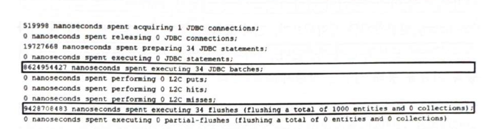

# 4장 배치처리

## 항목 46: 스프링 부트 스타일 배치 등록 방법
- 배치처리는 데이터베이스/네트워크 호출 횟수를 줄이는 것이 관건

### 배치 처리 활성화 및 JDBC URL 설정

#### 배치 크기 설정
`spring.jpa.properties.hibernate.jdbc.batch_size=30`</br>
- 권장값은 5~30 
- saveAll() 과 같이 한꺼번에 저장하는 Entity가 100개 라면 30개씩 끊어서 저장시킴

#### MySQL 배치 최적화
- rewriteBatchedStatements : 아래와 같이 2번 호출 -> 1번호출로 변경해줌
  ```
  insert into author (age, genre, name, id) values (23, '장르1', '이름1', 810);
  insert into author (age, genre, name, id) values (24, '장르2', '이름2', 811);

  ->

  insert into author (age, genre, name, id) values (23, '장르1', '이름1', 810), (24, '장르2', '이름2', 811);
  ```
- cachePrepStmts : 캐시 활성화
- useServerPrepStmts : 서버 프리페어드 스테이트먼트를 활성화
  - SQL 전송량 감소: SQL을 매번 완성된 형태로 보내지 않고, 변수 값만 전송 → 네트워크 부하 감소.
  - 성능 최적화: 서버에서 쿼리를 미리 컴파일하여 재사용 → 실행 속도 향상.

- MySQL은 기본적으로 클라이언트 측(백엔드 서버) 에서 SQL 명령어 캐싱을 비활성화함. cachePrepStmts=true 설정하면 클라이언트와 서버 프리페어드 스테이트먼트에 캐싱을 활성화할 수 있음.

- 캐싱상태 확인방법
  - `SHOW GLOBAL STATUS LIKE '%stmt%';`
- jdbc url 설정
  - `jdbc:mysql://localhost:3306/bookstoredb?cachePrepStmts=true&useServerPrepStmts=true&rewriteBatchedStatements=true`
- MySQL일때만 사용, 다른 DB의 경우는 사용불가함.

```
* 참고
클라이언트 vs 서버 프리페어드 스테이트먼트
	- 클라이언트 프리페어드 스테이트먼트 (기본 활성화)
	    -  SQL 실행 전에 클라이언트가 SQL을 미리 준비(prepare) 함.
	    -  SQL의 위치 지정자(placeholder, ?) 를 실제 값(literal) 으로 대체하여 완성된 SQL을 서버에 전송.
	    -  실행 시에는 클라이언트가 COM_QUERY 명령을 사용하여 완성된 SQL을 전달.
	-  서버 프리페어드 스테이트먼트 (기본 비활성화됨)
        -  useServerPrepStmts=true 설정 시 서버에서 프리페어드 스테이트먼트 활성화.
	    -  클라이언트가 COM_STMT_PREPARE 명령을 사용하여 SQL을 서버에 한 번만 전송.
	    -  서버가 쿼리를 준비(Prepare)하고, 클라이언트는 이후 실행 시 COM_STMT_EXECUTE 명령을 사용해 변수 값만 서버로 전송.
	    -  실행될 때 서버에서 직접 SQL을 실행.
```

### 배치 등록을 위한 엔터티 준비
```java
@Entity
public class Author implements Serializable {
    private static final long serialVersionUID = 1L;

    @Id
    private Long id;

    private String name;
    private String genre;
    private int age;
}
```
- `@GeneratedValue(strategy = GenerationType.IDENTITY` 사용 금지 (JDBC 배치 처리를 비활성화 함)

### 내장 `saveAll(Iterable<S> entities)` 단점 확인 및 방지

#### 1) 영속성 컨텍스트 플러시 및 클리어 제어 불가
- saveAll() 호출 시 트랜잭션이 커밋되기 전에 한 번에 모든 데이터를 영속성 컨텍스트에 저장.
- 대량 데이터(특히 Iterable 크기가 매우 큰 경우)가 한꺼번에 쌓이면 영속성 컨텍스트가 메모리를 과도하게 사용하여 성능 저하 발생.
- 트랜잭션 중단 시 롤백 영향이 커짐.
- 해결책
  - 데이터를 청크(chunk) 단위로 나누어 처리.
  - Iterable 크기를 배치 크기(batchSize)와 동일하게 맞춘 후 반복 호출.
  - 각 Iterable이 별도 트랜잭션에서 실행되므로 롤백 영향을 최소화.

#### 2) 개발자는 merge() 대신 persist()를 사용할 수 없음
- merge()의 문제점
  - saveAll()은 내부적으로 EntityManager#merge()를 호출.
  - merge()는 INSERT 전에 SELECT를 실행하여 기존 데이터를 확인함.
  - 즉, INSERT 트리거가 실행되기 전 SELECT 트리거가 먼저 실행됨.
  - SELECT가 많아질수록 성능 저하가 심해짐.

- 트리거로 인해 불필요한 SELECT 발생
  - 데이터베이스의 **트리거(trigger)**가 각 SELECT와 동일한 기본 키(Primary Key)를 확인해야 하므로 추가적인 성능 저하 발생.
  - @Version 필드를 사용하는 경우, 배치 처리 전에 추가적인 SELECT 실행이 필요하여 성능이 더 느려짐.

- 해결 방법
  - merge() 대신 persist()를 사용하여 SELECT 없이 바로 INSERT 실행.

#### 3) saveAll() 메서드는 영속된 엔터티를 포함하는 `List<S>`를 반환함
- saveAll()은 List를 반환
  - saveAll() 메서드는 저장된 영속성 엔티티를 포함하는 리스트(List)를 반환.
  - 하지만 배치 처리에서는 리스트가 필요하지 않을 수 있음.

  - 불필요한 List 생성
    - 배치 크기 30을 설정하고 1,000개 데이터를 저장하면 총 34개의 리스트(List)가 생성됨.
    - 이 리스트는 배치 처리에는 필요하지 않으며, 단순히 컨테이너 역할만 수행.
    - 의미 없는 객체가 추가로 생성되며 메모리 사용량 증가.

- 해결 방법
  - saveInBatch()를 사용하여 배치 등록 후 별도의 리스트 반환 없이 데이터만 저장.


### 올바른 방법의 커스텀 구현
#### 1. 배치 처리의 커스텀 구현
  - 배치 처리의 커스텀 구현을 사용하면 프로세스를 세밀하게 제어하고 최적화 가능.
  - `saveInBatch(Iterable<S> entities)` 메서드를 활용하여 성능을 개선.

#### 2. 커스텀 배치 처리의 주요 목표
- 각 배치 처리 후 트랜잭션 커밋
  - 데이터를 한꺼번에 저장하지 않고 배치 크기마다 커밋하여 메모리 사용 최적화.
- merge() 대신 persist() 사용
  - merge()는 기존 데이터를 확인하기 위해 불필요한 SELECT 쿼리 발생 → 성능 저하.
  - persist()를 사용하면 바로 INSERT 실행하여 성능 최적화 가능.
- 추가 발생하는 SELECT 피하기
  - @Version 필드를 사용하지 않으면, JPA가 자동으로 SELECT를 실행하는 문제 방지.
- List 반환을 피함
  - saveAll()은 저장 후 리스트(List)를 반환하여 메모리 사용 증가.
  - saveInBatch()는 리스트를 반환하지 않아 불필요한 객체 생성을 최소화.
- 스프링 스타일의 배치 처리 제공
  - `saveInBatch(Iterable<S> entities)`를 사용하여 트랜잭션 내에서 효율적으로 처리.

#### 3. 권장배치 크기
- 5~30 사이

#### 4. 배치 트랜잭션 관리
- 각 배치 실행 후 트랜잭션 커밋 필수
  - 배치를 처리할 때 각 배치 단위마다 데이터베이스에 반영(commit) 해야 함.
- 트랜잭션을 장기 실행하지 않도록 주의
  - MVCC(Multi-Version Concurrency Control)와 유사한 방식으로, 배치 크기를 조정하면 트랜잭션 확장 문제를 방지 가능.
  - 장애 발생 시 특정 배치의 커밋이 영향을 받지 않도록 설계.
- 트랜잭션 시작 전에 엔티티 관리자(EntityManager) 초기화
  - 배치 크기마다 flush() 및 clear()를 호출하여 메모리 사용을 최적화.
- 플러시-클리어 주기를 조절하여 성능 최적화
  - 메모리 사용량 증가 방지.
  - 트랜잭션을 짧게 유지하여 장기 실행 트랜잭션 문제 방지.

### BatchRepository 계약 작성
- BatchRepository는 기본적인 배치 저장 기능을 제공하는 인터페이스.
- JPA의 기본 JpaRepository를 확장하여 커스텀 배치 처리를 추가할 수 있도록 설계됨.
- 해당 인터페이스는 Spring이 자동으로 인식하지 않도록 @NoRepositoryBean을 적용.
```java
@NoRepositoryBean
public interface BatchRepository<T, ID extends Serializable> 
        extends JpaRepository<T, ID> {
    <S extends T> void saveInBatch(Iterable<S> entities);
}
```

### BatchRepository 구현 작성
- SimpleJpaRepository를 확장하여 배치 저장 기능을 추가.
- 배치 처리 시 불필요한 트랜잭션 오버헤드를 줄이기 위해 Propagation.NEVER 설정.
- saveInBatch() 메서드를 통해 배치 저장을 위임.
- BatchExecutor는 Spring 컴포넌트로 등록되어 직접 배치 처리를 수행.
- EntityManager를 사용하여 배치 단위로 커밋 & 클리어하여 메모리 절약.

```java
@Transactional(propagation = Propagation.NEVER)
public class BatchRepositoryImpl<T, ID extends Serializable>
        extends SimpleJpaRepository<T, ID> implements BatchRepository<T, ID> {

    @Override
    public <S extends T> void saveInBatch(Iterable<S> entities) {
        BatchExecutor batchExecutor = SpringContext.getBean(BatchExecutor.class);
        batchExecutor.saveInBatch(entities);
    }
}

@Component
public class BatchExecutor<T> {

    private static final Logger logger = Logger.getLogger(BatchExecutor.class.getName());

    @Value("${spring.jpa.properties.hibernate.jdbc.batch_size}")
    private int batchSize;

    private final EntityManagerFactory entityManagerFactory;

    public BatchExecutor(EntityManagerFactory entityManagerFactory) {
        this.entityManagerFactory = entityManagerFactory;
    }

    public <S extends T> void saveInBatch(Iterable<S> entities) {
        EntityManager entityManager = entityManagerFactory.createEntityManager();
        EntityTransaction entityTransaction = entityManager.getTransaction();

        try {
            entityTransaction.begin();
            int i = 0;
            for (S entity : entities) {
                if (i % batchSize == 0 && i > 0) {
                    logger.log(Level.INFO, "Flushing the EntityManager containing {0} entities ...", batchSize);
                    entityTransaction.commit();
                    entityTransaction.begin();
                    entityManager.clear();
                }
                entityManager.persist(entity);
                i++;
            }

            logger.log(Level.INFO, "Flushing the remaining entities ...");
            entityTransaction.commit();
        } catch (RuntimeException e) {
            if (entityTransaction.isActive()) {
                entityTransaction.rollback();
            }
            throw e;
        } finally {
            entityManager.close();
        }
    }
}
```
- 소스 상세 설명
  - SimpleJpaRepository 확장 → 기존 JPA 리포지토리 기능을 유지하면서 배치 기능 추가 가능.
  - 트랜잭션 전파 설정 (Propagation.NEVER)
    - Spring이 트랜잭션을 시작하지 않도록 설정하여 불필요한 트랜잭션 오버헤드 방지.
    - 배치 저장 과정에서 트랜잭션 관리는 BatchExecutor에서 처리.
  - BatchExecutor를 SpringContext에서 가져와서 배치 저장을 위임. 이를 통해 엔티티를 일괄적으로 처리하여 성능을 최적화.
  - spring.jpa.properties.hibernate.jdbc.batch_size 값을 가져와서 배치 단위를 결정.
  - 일정 개수(batchSize) 단위로 처리하여 메모리 사용량 절감.
  - entityManager.persist(entity)를 사용하여 엔티티를 직접 저장.
  - 배치 크기마다 flush() 및 clear() 실행 → 메모리 사용량 절감.
  - 일정 개수(batchSize)가 쌓이면 트랜잭션을 커밋하고 다시 시작.
  - 오류 발생 시 롤백을 수행하여 데이터 정합성 유지.


### BatchRepositoryImpl 기반 클래스 설정
- Spring Boot에서 커스텀 리포지토리를 사용하도록 설정.
- repositoryBaseClass 속성을 BatchRepositoryImpl.class로 지정.
```java
@SpringBootApplication
@EnableJpaRepositories(repositoryBaseClass = BatchRepositoryImpl.class)
public class MainApplication {
}
```

### 테스트확인
```java
@Repository
public interface AuthorRepository extends BatchRepository<Author, Long> {
}

public void batchAuthors() {
    List<Author> authors = new ArrayList<>();
    for (int i = 0; i < 1000; i++) {
        Author author = new Author();
        author.setId((long) i + 1);
        author.setName("Name_" + i);
        author.setGenre("Genre_" + i);
        author.setAge(18 + i);
        authors.add(author);
    }
    authorRepository.saveInBatch(authors);
}
```



- 1000개의 데이터를 34개의 배치 단위로 실행하고, 34번의 플러시가 발생한 것을 확인.
- 배치 처리 자동 활성화가 되지 않을 수 있으므로 실행 로그와 명령문 수를 확인 필요.


## 항목 47: 부모-자식 관계 배치 등록 최적화 방법